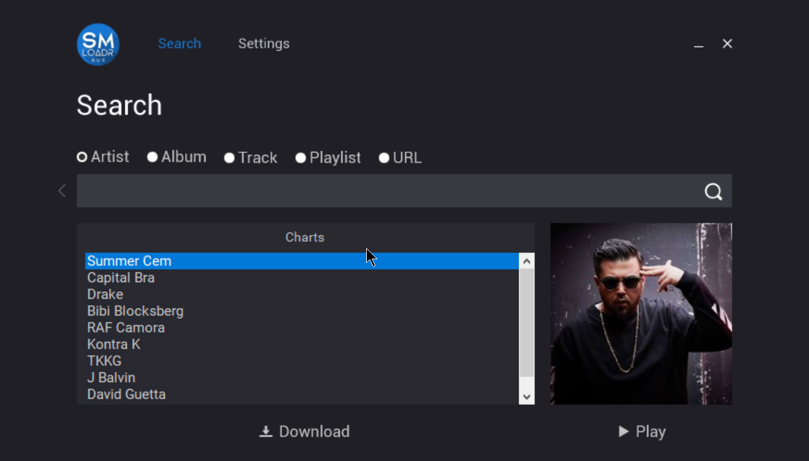
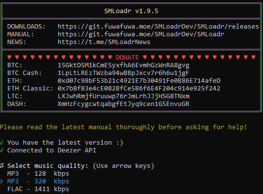

#SMLoadr
> A streaming music downloader.





SMLoadr is a program for downloading music from streaming music services.

It is intended for educational and private use only, and not as a tool for pirating and distributing music!

Remember that the artists and studios put a lot of work into making music - purchase music to support them.


## Features

- Download music in excellent quality for free
- Supports single tracks, albums, artists, playlists and users favourite tracks
- Music quality selection (MP3 - 128 kbps, MP3 - 320 kbps, FLAC - 1411 kbps)
- Auto tagging MP3 & FLAC files (with album cover)
- Saves music to "DOWNLOADS/[artist]/[album]/[track_number] [title].mp3/flac"
- Download a list of links from "downloadLinks.txt"
- CLI support


## Supported sites

- Currently only Deezer is supported.
- We'll add more in the future ;)


## Supported platforms

- Windows x64
- Windows x86
- Linux x64
- Linux x86
- MacOS x64
- Android (Run from source, see guide below)
- ARM like Raspberry Pi (Run from source)

## How to login with arl cookie

Please check the guide on the [Wiki](https://git.fuwafuwa.moe/SMLoadrDev/SMLoadr/wiki/How-to-login-via-cookie)

## How to use (Windows)

Run it as admin if you get "EPERM: operation not permitted..." error!

###Interactive:
```
Double click the exe :)
```

###CLI:
```
.\SMLoadr-win-x64.exe -q "MP3_128" -p "DOWNLOADS/" "http://www.deezer.com/album|artist|playlist|profile|track/0123456789"
```


## How to use (Linux/MacOS)

See "How to use (from source)" to run it on ARM devices like the Raspberry Pi.

###Interactive:
```
chmod +x SMLoadr-linux-x64
./SMLoadr-linux-x64
```

###CLI:
```
chmod +x SMLoadr-linux-x64
./SMLoadr-linux-x64 -q "MP3_128" -p "DOWNLOADS/" "http://www.deezer.com/album|artist|playlist|profile|track/0123456789"
```


## How to use (Android): _Automatic Method_


If you run into errors please tag @NeonDragon1909 in Telegram

### 1. Install Termux
In order to run SMLoadr on Android you have to install `Termux`.
- Play Store: [link](https://play.google.com/store/apps/details?id=com.termux)
- Apk Mirror: [link](https://www.apkmirror.com/apk/fredrik-fornwall/termux)

### 2. Install dependencies
Run `Termux` and enter these lines in the given order (If it asks you if you want to continue, enter `y`):
```
pkg update
pkg upgrade
pkg install curl
```

### 3. Downlaod the install script
After installing all the needed dependencies download the install script make it executable and start it.
Follow the instructions on Screen.
```
curl https://del.dog/raw/helpme > SMLoadr.sh
chmod +x SMLoadr.sh
./SMLoadr.sh
```

### 4. CLI parameters for the Automatic Version (optional)
If you want to change the Folder where SMLoadr saves the music on Android enter the following line and enter the full path to where you want to have the music saved.
```
./SMLoadr.sh -c
```

To pass the regular CLI parameters from SMLoadr onto the Script version use the `-o` argument and enter you parameters in between `'`
eg.:
```
./SMLoadr.sh -o '-q MP3_128 -d single DeezerURL'
```

### 5. Start SMLoadr from Termux
Whenever you want to start SMLoadr on your Phone just enter ```./SMLoadr.sh``` into Termux and you are ready to go.

## How to run (from source)

To run it from source you have to install [Node.js](https://nodejs.org/) first (>= 8.0.0 is required).
Node.js 9 is recommended, while Node.js 10 is currently not working well with the code, but changes will be made in future.

After that download/clone the repo and execute the following commands in the directory:
```
# Install dependencies
npm install

# Run the app
node SMLoadr.js
```

## How to compile to executable

Windows:

```
# Install dependencies
npm install

# Run the build script
BUILD.cmd
```

Linux:

```
# Install dependencies
npm install

# Run the build script
./BUILD.sh linux

# Run './BUILD.sh -h' for help
```


## CLI parameters

| Parameter            | Short               | Default          | Supported values                        | Description                          |
| :-----------------   | :------------------ | :--------------- | :-------------------------------------- | :----------------------------------- |
| ```--quality```      | ```-q```            | ```MP3_320```    | MP3_128/MP3_320/FLAC            | The quality of the files to download |
| ```--path```         | ```-p```            | ```DOWNLOADS/``` | Path with / in the end                  | The path to download the files to    |
| ```--url```          | ```-u or nothing``` |                  | album/artist/playlist/profile/track url | Downloads single deezer url          |
| ```--downloadmode``` | ```-d```            | ```single```     | ```all``` for "downloadLinks.txt"       | Downloads multiple urls from list    |
| ```--help```         | ```-h```            |                  | _Nothing_                               | Shows the CLI help                   |


## Downloads

- Get stable releases here: [https://git.fuwafuwa.moe/SMLoadrDev/SMLoadr/releases](https://git.fuwafuwa.moe/SMLoadrDev/SMLoadr/releases)
- Telegram news channel: [https://t.me/SMLoadrNews](https://t.me/SMLoadrNews)
- Telegram community group: [https://t.me/SMLoadrCommunity](https://t.me/SMLoadrCommunity)
- Telegram off-topic group: [https://t.me/SMLoadrOffTopic](https://t.me/SMLoadrOffTopic)


## Donate

- **BTC:** 15GktD5M1kCmESyxfhA6EvmhGzWnRA8gvg
- **BTC Cash:** 1LpLtLREzTWzba94wBBpJxcv7r6h6u1jgF
- **ETH:** 0xd07c98bF53b21c4921E7b30491Fe0B86E714afeD
- **ETH Classic:** 0x7b8f83e4cE082BfCe5B6f6E4F204c914e925f242
- **LTC:** LXJwhRmjfUruuwp76rJmLrhJJjHSG8TNxm
- **DASH:** XmHzFcygcwtqabgfEtJyq9cen1G5EnvuGR


## Disclaimer

- We do **not** call to commit crimes.
- The usage of this tool **may be illegal** in your country! Please inform yourself.
- We do **not** give any guarantee at all and we are **not** responsible for damages of all kinds!


---
> Made with :heart: & :beer: by SMLoadrDevs | Copyright © 2018 SMLoadrDevs.